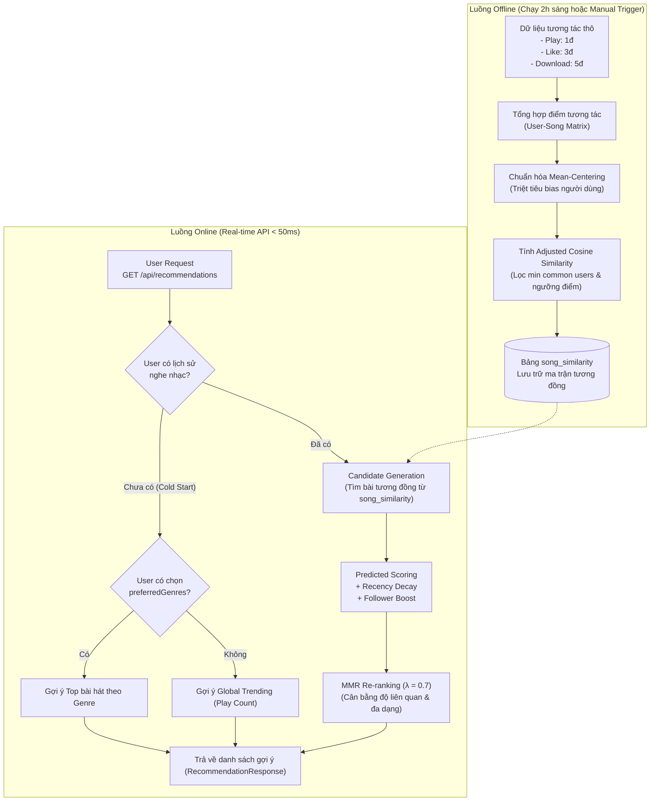

# 🎵 Music Streaming Platform & Intelligent Recommendation Backend

<p align="center">
  
  
  
  
  
  
  
</p>

Backend RESTful API hoàn chỉnh cho nền tảng **Phát nhạc trực tuyến (Music Streaming)** kết hợp **Hệ thống Gợi ý Âm nhạc Thông minh (Intelligent Music Recommendation System)** xây dựng trên nền tảng **Spring Boot 3 (Java 21)**. Dự án tích hợp hệ thống xác thực phân quyền chuẩn doanh nghiệp (JWT, RBAC), quản lý đa phương tiện đám mây (Cloudinary) và thuật toán gợi ý cá nhân hóa dựa trên học máy (Item-Based Collaborative Filtering với Adjusted Cosine Similarity & MMR Re-ranking).

---

## 📑 Mục lục
- [1. Tính Năng Nổi Bật](#-1-tính-năng-nổi-bật)
- [2. Kiến Trúc Hệ Thống Gợi Ý (Recommendation Architecture)](#-2-kiến-trúc-hệ-thống-gợi-ý-recommendation-architecture)
- [3. Công Nghệ Sử Dụng (Tech Stack)](#-3-công-nghệ-sử-dụng-tech-stack)
- [4. Cấu Trúc Thư Mục (Project Structure)](#-4-cấu-trúc-thư-mục-project-structure)
- [5. Yêu Cầu Hệ Thống & Cài Đặt (Prerequisites & Installation)](#-5-yêu-cầu-hệ-thống--cài-đặt-prerequisites--installation)
- [6. Cấu Hình Ứng Dụng (Configuration)](#-6-cấu-hình-ứng-dụng-configuration)
- [7. Hướng Dẫn Khởi Chạy (How to Run)](#-7-hướng-dẫn-khởi-chạy-how-to-run)
- [8. Tài Liệu REST API (API Endpoints Reference)](#-8-tài-liệu-rest-api-api-endpoints-reference)
- [9. Định Dạng Phản Hồi Chuẩn (API Response Format)](#-9-định-dạng-phản-hồi-chuẩn-api-response-format)
- [10. Kiểm Thử Với Postman (Postman Collection)](#-10-kiểm-thử-với-postman-postman-collection)

---

## 🌟 1. Tính Năng Nổi Bật

### 🔐 Quản lý Danh tính & Bảo mật (Identity & Security)
- **Xác thực JWT (JSON Web Token)**: Hỗ trợ tạo token, kiểm tra hiệu lực (Introspect), gia hạn token (Refresh) và đăng xuất an toàn với cơ chế thu hồi token (Token Invalidation Blacklist).
- **Phân quyền người dùng (RBAC)**: Quản lý động các Vai trò (`Role`) và Quyền hạn (`Permission`), kiểm soát truy cập từng API qua `@PreAuthorize`.
- **Quản lý Tài khoản**: Đăng ký với chọn thể loại yêu thích (`preferredGenres`), cập nhật hồ sơ, đổi mật khẩu, tải lên ảnh đại diện, kiểm duyệt khóa/mở khóa tài khoản (`block/unblock`).
- **Tài khoản khởi tạo tự động**: Tự động sinh tài khoản Admin mặc định khi hệ thống khởi chạy lần đầu.

### 🎧 Quản lý Âm nhạc Toàn diện (Music Catalog Management)
- **Bài hát (Songs)**: Quản lý bài hát, upload file âm thanh (MP3) và ảnh bìa lên Cloudinary, đếm lượt phát thực tế (`playCount`), danh sách nghe gần đây, bảng xếp hạng thịnh hành (`top-charts`), tải bài hát về thiết bị.
- **Nghệ sĩ (Artists)**: Quản lý thông tin nghệ sĩ, tiểu sử, avatar, danh sách bài hát/album phát hành, hệ thống theo dõi nghệ sĩ (Followers).
- **Album**: Tạo và quản lý album, gán bài hát và nghệ sĩ, lọc album theo thể loại.
- **Danh sách phát (Playlists)**: Tạo playlist cá nhân, thêm/xóa bài hát, upload cover, tự động gợi ý playlist theo thể loại (`auto-playlists`).
- **Thể loại (Genres)**: Quản lý phân loại dòng nhạc, thống kê thể loại thịnh hành (`trending genres`).

### 💬 Tương tác Xã hội & Đánh giá (Social & User Interactions)
- **Yêu thích (Favorites)**: Thả tim/bỏ thích bài hát, xem danh sách bài hát yêu thích của tôi.
- **Bình luận (Comments)**: Bình luận trên từng bài hát, chỉnh sửa, xóa bình luận.
- **Theo dõi (Followers)**: Theo dõi nghệ sĩ yêu thích, đếm số lượng người theo dõi.
- **Báo cáo (Reports)**: Báo cáo vi phạm cho bài hát/bình luận/tài khoản; quy trình duyệt báo cáo dành cho Quản trị viên (`PENDING`, `RESOLVED`, `REJECTED`).

### 🧠 Hệ thống Gợi ý Âm nhạc Thông minh (AI/ML Recommendation Engine)
- Triển khai thuật toán **Item-Based Collaborative Filtering** với **Adjusted Cosine Similarity**.
- Tích hợp 2 luồng xử lý: **Luồng Offline** (Cron Job tính ma trận tương đồng ban đêm) & **Luồng Online** (Real-time API độ trễ < 50ms).
- Khắc phục bài toán **Cold Start** cho người dùng mới qua thể loại yêu thích và Global Trending.
- Đa dạng hóa danh sách gợi ý bằng thuật toán **MMR (Maximal Marginal Relevance) Re-ranking** ($\lambda = 0.7$).
- Tích hợp **Recency Decay** (ưu tiên hành vi gần) & **Follower Boost** (tăng trọng số bài hát của nghệ sĩ đang follow).

---

## 🔬 2. Kiến Trúc Hệ Thống Gợi Ý (Recommendation Architecture)

Hệ thống gợi ý được chia làm 2 giai đoạn độc lập: **Offline Batch Computation** và **Online Real-time Serving**.



### Công thức tính toán chính
1. **Mean-Centering Rating**:
   $$\bar{r}_u = \frac{1}{|I_u|} \sum_{i \in I_u} r_{u,i}, \quad s_{u,i} = r_{u,i} - \bar{r}_u$$

2. **Adjusted Cosine Similarity giữa bài hát $i$ và bài hát $j$**:
   $$\text{sim}(i, j) = \frac{\sum_{u \in U} (r_{u,i} - \bar{r}_u)(r_{u,j} - \bar{r}_u)}{\sqrt{\sum_{u \in U} (r_{u,i} - \bar{r}_u)^2} \sqrt{\sum_{u \in U} (r_{u,j} - \bar{r}_u)^2}}$$

3. **Maximal Marginal Relevance (MMR) Re-ranking**:
   $$\text{MMR}(d) = \lambda \cdot \text{Relevance}(d) - (1 - \lambda) \cdot \max_{s \in S} \text{Sim}(d, s)$$
   *Trong đó $\lambda = 0.7$ giúp bài hát gợi ý vừa đúng gu nghe nhạc, vừa đa dạng không bị lặp lại một nghệ sĩ/thể loại.*

---

## 🛠 3. Công Nghệ Sử Dụng (Tech Stack)

| Thành phần | Công nghệ / Thư viện | Phiên bản | Mô tả |
|---|---|---|---|
| **Ngôn ngữ** | Java | 21 (LTS) | Phiên bản Java hiệu năng cao, Virtual Threads sẵn sàng |
| **Framework chính** | Spring Boot | 3.2.2 | Core framework, Spring Web MVC, Scheduled Jobs |
| **Bảo mật** | Spring Security, Nimbus JOSE+JWT | 6.x | OAuth2 Resource Server, Stateless JWT Authentication |
| **Cơ sở dữ liệu** | MySQL | 8.0+ | Hệ quản trị cơ sở dữ liệu quan hệ chính |
| **ORM / Data Access**| Spring Data JPA, Hibernate | 3.2.2 | Ánh xạ thực thể, Auditing, Custom Native Queries |
| **Lưu trữ Đám mây** | Cloudinary SDK | 1.36.0 | Lưu trữ tệp âm thanh MP3 và hình ảnh (Avatar, Covers) |
| **Biên dịch & Code Gen**| Project Lombok, MapStruct | 1.18.36 / 1.6.3 | Tự động sinh Getter/Setter, Builder, Mapper DTO ↔ Entity |
| **Build Tool** | Apache Maven Wrapper (`mvnw`) | 3.9.x | Quản lý dependencies và build dự án |
| **Container** | Docker & Docker Compose | - | Đóng gói và chạy môi trường cơ sở dữ liệu / dịch vụ |

---

## 📁 4. Cấu Trúc Thư Mục (Project Structure)

```text
identity-service-main/
└── identity-service-main/
    ├── src/
    │   ├── main/
    │   │   ├── java/com/devteria/identityservice/
    │   │   │   ├── configuration/     # Cấu hình Spring Security, JWT, Cloudinary, Auditing, AppInit
    │   │   │   ├── constant/          # Các hằng số (PredefinedRole,...)
    │   │   │   ├── controller/        # REST Controllers (16 controllers)
    │   │   │   ├── dto/               # Data Transfer Objects (request, response)
    │   │   │   ├── entity/            # JPA Entities (User, Song, Album, Artist, Playlist, Similarity,...)
    │   │   │   ├── enums/             # Enum types (Status, SongType, ReportStatus,...)
    │   │   │   ├── exception/         # Xử lý lỗi toàn cục (GlobalExceptionHandler, ErrorCode, AppException)
    │   │   │   ├── mapper/            # MapStruct mappers (UserMapper, RoleMapper, PagingMapper,...)
    │   │   │   ├── repository/        # Spring Data JPA Repositories
    │   │   │   ├── service/           # Business logic & Recommendation Engine Services
    │   │   │   └── validator/         # Custom Validation (DobConstraint,...)
    │   │   └── resources/
    │   │       ├── application.yaml       # Cấu hình môi trường dev
    │   │       └── application-prod.yaml  # Cấu hình môi trường production
    │   └── test/                          # Unit test & Integration test
    ├── Dockerfile                         # Dockerfile đóng gói ứng dụng
    ├── Identity Service.postman_collection.json # Bộ sưu tập kiểm thử API qua Postman
    ├── mvnw / mvnw.cmd                    # Maven wrapper
    └── pom.xml                            # Quản lý thư viện Maven
```

---

## 💻 5. Yêu Cầu Hệ Thống & Cài Đặt (Prerequisites & Installation)

### Yêu cầu tiên quyết
- **JDK 21** trở lên ([Oracle JDK 21](https://www.oracle.com/java/technologies/downloads/) hoặc [Eclipse Temurin 21](https://adoptium.net/temurin/releases/)).
- **MySQL 8.0+** đang chạy trên cổng `3306`.
- **Git** đã được cài đặt.
- *(Tùy chọn)* **Docker** & **Docker Compose** nếu muốn chạy ứng dụng qua container.

### Chuẩn bị Cơ sở dữ liệu
Tạo cơ sở dữ liệu trống trong MySQL:
```sql
CREATE DATABASE IF NOT EXISTS identity_service CHARACTER SET utf8mb4 COLLATE utf8mb4_unicode_ci;
```

---

## ⚙️ 6. Cấu Hình Ứng Dụng (Configuration)

Cấu hình chính nằm tại file `src/main/resources/application.yaml`. Bạn có thể tinh chỉnh hoặc truyền qua biến môi trường:

```yaml
server:
  port: 8080
  servlet:
    context-path: /identity   # Base path cho toàn bộ API

spring:
  datasource:
    url: ${DBMS_CONNECTION:jdbc:mysql://localhost:3306/identity_service}
    username: ${DBMS_USERNAME:root}
    password: ${DBMS_PASSWORD:root}
    driverClassName: "com.mysql.cj.jdbc.Driver"
  jpa:
    hibernate:
      ddl-auto: update        # Tự động cập nhật bảng trong DB
    show-sql: false
  servlet:
    multipart:
      max-file-size: 20MB     # Dung lượng tối đa 1 file tải lên (MP3 / ảnh)
      max-request-size: 40MB

jwt:
  signerKey: "1TjXchw5FloESb63Kc+DFhTARvpWL4jUGCwfGWxuG5SIf/1y/LgJxHnMqaF6A/ij"
  valid-duration: 3600        # Thời gian sống của Access Token: 1 giờ (giây)
  refreshable-duration: 36000 # Thời gian cho phép Refresh Token: 10 giờ (giây)
```

> [!NOTE]
> Thông tin API Cloudinary được cấu hình trong `CloudinaryConfig.java`. Bạn có thể thay đổi bằng thông tin tài khoản Cloudinary của bạn nếu cần lưu trữ riêng.

---

## 🚀 7. Hướng Dẫn Khởi Chạy (How to Run)

### Cách 1: Chạy trực tiếp từ dòng lệnh (Maven Wrapper)

Di chuyển vào thư mục dự án chứa mã nguồn:
```bash
cd identity-service-main
```

Chạy ứng dụng:
- **Windows**:
  ```powershell
  .\mvnw.cmd spring-boot:run
  ```
- **Linux / macOS**:
  ```bash
  chmod +x ./mvnw
  ./mvnw spring-boot:run
  ```

Sau khi ứng dụng khởi chạy thành công, API sẽ hoạt động tại:
```
http://localhost:8080/identity
```

### Cách 2: Đóng gói và chạy file JAR
```bash
# Build file jar (bỏ qua test)
./mvnw clean package -DskipTests

# Chạy file jar đã tạo
java -jar target/identity-service-0.0.1.jar
```

### Cách 3: Chạy bằng Docker
```bash
# Build Docker image
docker build -t identity-service:latest .

# Khởi chạy cùng mạng với MySQL
docker run -d --name identity-service -p 8080:8080 \
  -e DBMS_CONNECTION=jdbc:mysql://host.docker.internal:3306/identity_service \
  -e DBMS_USERNAME=root \
  -e DBMS_PASSWORD=root \
  identity-service:latest
```

---

## 🔑 8. Tài Khoản & Phân Quyền Mặc Định

Khi khởi chạy ứng dụng lần đầu, hệ thống sẽ tự động tạo tài khoản Quản trị viên (Admin) mặc định:
- **Username**: `admin`
- **Password**: `admin`
- **Roles**: `ADMIN`

> [!IMPORTANT]
> Sau khi đăng nhập lần đầu, khuyến nghị sử dụng API `/users/change-password` để đổi mật khẩu quản trị viên vì lý do bảo mật.

---

## 📡 9. Danh Sách REST API Chi Tiết (API Endpoints Reference)

Tất cả các endpoints đều có tiền tố: `http://localhost:8080/identity`

### 1. Xác thực & Quản lý Token (`/auth`)
| Method | Endpoint | Yêu cầu Auth | Mô tả |
|---|---|---|---|
| `POST` | `/auth/token` | Public | Đăng nhập lấy JWT Access Token |
| `POST` | `/auth/introspect` | Public | Kiểm tra tính hợp lệ của Token |
| `POST` | `/auth/refresh` | Public | Gia hạn Token mới bằng Refresh Token |
| `POST` | `/auth/logout` | Public | Đăng xuất và thu hồi (blacklist) Token |

### 2. Quản lý Người dùng (`/users`)
| Method | Endpoint | Yêu cầu Auth | Mô tả |
|---|---|---|---|
| `POST` | `/users` | Public | Đăng ký tài khoản (kèm thể loại yêu thích `preferredGenreIds`) |
| `GET` | `/users` | `ADMIN` | Lấy danh sách toàn bộ người dùng trong hệ thống |
| `GET` | `/users/{userId}` | Authenticated | Xem chi tiết thông tin người dùng theo ID |
| `GET` | `/users/my-info` | Authenticated | Lấy thông tin cá nhân của người dùng đang đăng nhập |
| `PUT` | `/users/{userId}` | Authenticated | Cập nhật thông tin người dùng |
| `DELETE` | `/users/{userId}` | `ADMIN` | Xóa người dùng |
| `POST` | `/users/{userId}/upload` | Authenticated | Tải lên ảnh đại diện (Avatar) lên Cloudinary |
| `PUT` | `/users/change-password` | Authenticated | Đổi mật khẩu cá nhân |
| `PATCH`| `/users/{userId}/block` | `ADMIN` | Khóa tài khoản người dùng |
| `PATCH`| `/users/{userId}/unblock` | `ADMIN` | Mở khóa tài khoản người dùng |

### 3. Gợi ý Âm nhạc Thông minh (`/api/recommendations`)
| Method | Endpoint | Yêu cầu Auth | Mô tả |
|---|---|---|---|
| `GET` | `/api/recommendations?userId={id}&limit=10` | Authenticated | Gợi ý danh sách bài hát cá nhân hóa (Collaborative Filtering + MMR) |
| `GET` | `/api/recommendations/home?userId={id}` | Authenticated | Gợi ý tổng hợp cho Trang chủ (Bài hát, Nghệ sĩ, Album, Playlist) |
| `POST`| `/api/admin/recommendations/trigger-full-pipeline` | `ADMIN` | Kích hoạt thủ công toàn bộ pipeline gợi ý offline |
| `POST`| `/api/admin/recommendations/trigger-sync` | `ADMIN` | Đồng bộ dữ liệu tương tác thô (Play, Like, Download) |
| `POST`| `/api/admin/recommendations/trigger-similarity` | `ADMIN` | Tính toán lại ma trận tương đồng `song_similarity` |

### 4. Quản lý Bài hát (`/songs`)
| Method | Endpoint | Yêu cầu Auth | Mô tả |
|---|---|---|---|
| `POST` | `/songs` | `ADMIN` | Tạo thông tin bài hát mới |
| `GET` | `/songs` | Authenticated | Lấy danh sách bài hát phân trang |
| `GET` | `/songs/{songId}` | Authenticated | Xem chi tiết bài hát |
| `PUT` | `/songs/{songId}` | `ADMIN` | Cập nhật thông tin bài hát |
| `DELETE`| `/songs/{songId}` | `ADMIN` | Xóa bài hát |
| `POST` | `/songs/{songId}/upload` | `ADMIN` | Upload tệp MP3 và ảnh bìa bài hát lên Cloudinary |
| `POST` | `/songs/{songId}/play` | Authenticated | Nghe bài hát (tăng lượt nghe và tạo log tương tác) |
| `GET` | `/songs/top-charts` | Authenticated | Bảng xếp hạng các bài hát có lượt nghe cao nhất |
| `GET` | `/songs/{songId}/download`| Authenticated | Tải bài hát về và ghi nhận hành vi download |
| `GET` | `/songs/downloaded` | Authenticated | Danh sách các bài hát người dùng đã tải về |
| `GET` | `/songs/recently-played` | Authenticated | Danh sách các bài hát người dùng nghe gần đây |
| `GET` | `/songs/search` | Authenticated | Tìm kiếm bài hát theo từ khóa |

### 5. Quản lý Album (`/albums`)
| Method | Endpoint | Yêu cầu Auth | Mô tả |
|---|---|---|---|
| `POST` | `/albums` | `ADMIN` | Tạo Album mới |
| `GET` | `/albums` | Authenticated | Lấy danh sách tất cả Album |
| `GET` | `/albums/{albumId}` | Authenticated | Xem chi tiết thông tin Album |
| `PUT` | `/albums/{albumId}` | `ADMIN` | Cập nhật Album |
| `DELETE`| `/albums/{albumId}` | `ADMIN` | Xóa Album |
| `POST` | `/albums/{albumId}/upload` | `ADMIN` | Tải lên ảnh bìa Album |
| `PUT` | `/albums/{albumId}/songs/{songId}` | `ADMIN` | Thêm bài hát vào Album |
| `DELETE`| `/albums/{albumId}/songs/{songId}` | `ADMIN` | Xóa bài hát khỏi Album |
| `GET` | `/albums/genre/{genreId}` | Authenticated | Lọc Album theo thể loại nhạc |

### 6. Quản lý Nghệ sĩ (`/artists`)
| Method | Endpoint | Yêu cầu Auth | Mô tả |
|---|---|---|---|
| `POST` | `/artists` | `ADMIN` | Tạo hồ sơ nghệ sĩ |
| `GET` | `/artists` | Authenticated | Danh sách tất cả nghệ sĩ |
| `GET` | `/artists/{artistId}` | Authenticated | Xem thông tin chi tiết nghệ sĩ |
| `PUT` | `/artists/{artistId}` | `ADMIN` | Cập nhật thông tin nghệ sĩ |
| `DELETE`| `/artists/{artistId}` | `ADMIN` | Xóa nghệ sĩ |
| `POST` | `/artists/{artistId}/upload`| `ADMIN` | Upload ảnh chân dung nghệ sĩ |
| `GET` | `/artists/search` | Authenticated | Tìm kiếm nghệ sĩ theo tên |

### 7. Danh sách phát (`/playlists`)
| Method | Endpoint | Yêu cầu Auth | Mô tả |
|---|---|---|---|
| `POST` | `/playlists` | Authenticated | Tạo playlist mới cho người dùng |
| `GET` | `/playlists/myList` | Authenticated | Lấy danh sách playlist của tôi |
| `GET` | `/playlists/{playlistId}` | Authenticated | Xem chi tiết playlist |
| `PUT` | `/playlists/{playlistId}` | Authenticated | Sửa tiêu đề/mô tả playlist |
| `DELETE`| `/playlists/{playlistId}` | Authenticated | Xóa playlist |
| `POST` | `/playlists/{playlistId}/songs/{songId}` | Authenticated | Thêm bài hát vào playlist |
| `DELETE`| `/playlists/{playlistId}/songs/{songId}` | Authenticated | Gỡ bài hát khỏi playlist |
| `POST` | `/playlists/{playlistId}/upload` | Authenticated | Upload ảnh bìa playlist |
| `GET` | `/playlists/genre/{genreId}` | Authenticated | Danh sách playlist theo thể loại |

### 8. Thể loại Âm nhạc (`/genres`)
| Method | Endpoint | Yêu cầu Auth | Mô tả |
|---|---|---|---|
| `GET` | `/genres` | Public | Lấy danh sách toàn bộ thể loại nhạc |
| `GET` | `/genres/{genreId}` | Authenticated | Xem thông tin chi tiết thể loại |
| `POST` | `/genres` | `ADMIN` | Tạo thể loại nhạc mới |
| `PUT` | `/genres/{genreId}` | `ADMIN` | Cập nhật thể loại |
| `DELETE`| `/genres/{genreId}` | `ADMIN` | Xóa thể loại |
| `GET` | `/genres/trending` | Authenticated | Lấy các thể loại nhạc đang thịnh hành |
| `GET` | `/genres/auto-playlists`| Authenticated | Tạo playlist tự động theo các thể loại |

### 9. Yêu thích, Bình luận, Theo dõi & Báo cáo
| Module | Method | Endpoint | Mô tả |
|---|---|---|---|
| **Yêu thích** | `POST` | `/favorites/{songId}` | Thích bài hát (Ghi nhận điểm LIKE = 3đ) |
| | `DELETE` | `/favorites/{songId}` | Bỏ thích bài hát |
| | `GET` | `/favorites/my-favorites` | Lấy danh sách bài hát yêu thích của tôi |
| **Bình luận** | `POST` | `/comments/song/{songId}/comments` | Đăng bình luận cho bài hát |
| | `GET` | `/comments/song/{songId}` | Danh sách bình luận của bài hát |
| | `PUT` | `/comments/{commentId}` | Sửa bình luận |
| | `DELETE`| `/comments/{commentId}` | Xóa bình luận |
| **Theo dõi** | `POST` | `/followers/{artistId}` | Theo dõi nghệ sĩ |
| | `DELETE`| `/followers/{artistId}` | Bỏ theo dõi nghệ sĩ |
| | `GET` | `/followers/artists/{artistId}/count` | Lấy số lượng người theo dõi nghệ sĩ |
| | `GET` | `/followers/my-artists` | Danh sách các nghệ sĩ đang theo dõi |
| **Báo cáo** | `POST` | `/reports` | Gửi báo cáo vi phạm nội dung |
| | `GET` | `/reports/my-reports` | Lịch sử báo cáo của tôi |
| | `GET` | `/reports` | Xem toàn bộ báo cáo (Dành cho Admin) |
| | `PUT` | `/reports/{reportId}/status` | Cập nhật trạng thái báo cáo (Admin) |

### 10. Quản lý Roles & Permissions (`/roles`, `/permissions`)
| Method | Endpoint | Yêu cầu Auth | Mô tả |
|---|---|---|---|
| `POST` | `/roles` | `ADMIN` | Tạo Role mới |
| `GET` | `/roles` | `ADMIN` | Xem danh sách Roles |
| `DELETE`| `/roles/{role}` | `ADMIN` | Xóa Role |
| `POST` | `/permissions` | `ADMIN` | Tạo Permission mới |
| `GET` | `/permissions` | `ADMIN` | Xem danh sách Permissions |
| `DELETE`| `/permissions/{permission}`| `ADMIN` | Xóa Permission |

---

## 📦 10. Định Dạng Phản Hồi Chuẩn (API Response Format)

Mọi phản hồi từ hệ thống đều được gói trong cấu trúc đối tượng `ApiResponse<T>` đồng nhất:

### Phản hồi thành công (HTTP 200 / 201)
```json
{
  "code": 1000,
  "message": "Thao tác thành công",
  "result": {
    "id": "e838cf4f-80c7-43cf-bc08-b80c55fbc74d",
    "username": "johndoe",
    "firstName": "John",
    "lastName": "Doe"
  }
}
```

### Phản hồi thất bại (HTTP 4xx / 5xx)
```json
{
  "code": 1002,
  "message": "User existed",
  "result": null
}
```

### Mã lỗi phổ biến (`ErrorCode`)
| Code | Thông báo | HTTP Status | Giải thích |
|---|---|---|---|
| `1000` | Success | 200 OK | Yêu cầu xử lý thành công |
| `1001` | Uncategorized error | 400 Bad Request | Khóa hoặc tham số không hợp lệ |
| `1002` | User existed | 400 Bad Request | Tên tài khoản đã tồn tại |
| `1005` | User not existed | 404 Not Found | Không tìm thấy người dùng |
| `1006` | Unauthenticated | 401 Unauthorized | Chưa xác thực hoặc Token hết hạn |
| `1007` | You do not have permission | 403 Forbidden | Không đủ quyền hạn truy cập |
| `1009` | Old password is incorrect | 400 Bad Request | Mật khẩu cũ không chính xác |
| `1011` | Your account has been blocked | 403 Forbidden | Tài khoản đã bị quản trị viên khóa |
| `2005` | Song not existed | 404 Not Found | Bài hát không tồn tại |
| `2007` | Failed to upload files to Cloudinary | 400 Bad Request | Lỗi upload file đa phương tiện |

---

## 📮 11. Kiểm Thử Với Postman (Postman Collection)

File Postman Collection được đính kèm sẵn trong thư mục dự án:
`identity-service-main/Identity Service.postman_collection.json`

### Các bước kiểm thử:
1. Mở Postman $\rightarrow$ Chọn **Import** $\rightarrow$ Kéo thả file `Identity Service.postman_collection.json`.
2. Tạo Request `POST /identity/auth/token` với body:
   ```json
   {
     "username": "admin",
     "password": "admin"
   }
   ```
3. Lấy chuỗi `token` trong trường `result.token` và đặt vào header cho các request cần xác thực:
   ```text
   Authorization: Bearer <token_cua_ban>
   ```
4. Kiểm tra luồng gợi ý:
   - Chạy `POST /identity/api/admin/recommendations/trigger-full-pipeline` để tổng hợp dữ liệu.
   - Gọi `GET /identity/api/recommendations?userId=<userId>&limit=10` để xem kết quả cá nhân hóa.

---

## 📄 12. Giấy Phép & Đóng Góp

- Dự án được phát triển phục vụ mục đích học tập, nghiên cứu và xây dựng hệ thống nền tảng dịch vụ âm nhạc trực tuyến.
- Mọi đóng góp, báo lỗi (Issue) hoặc Pull Request đều được hoan nghênh!
